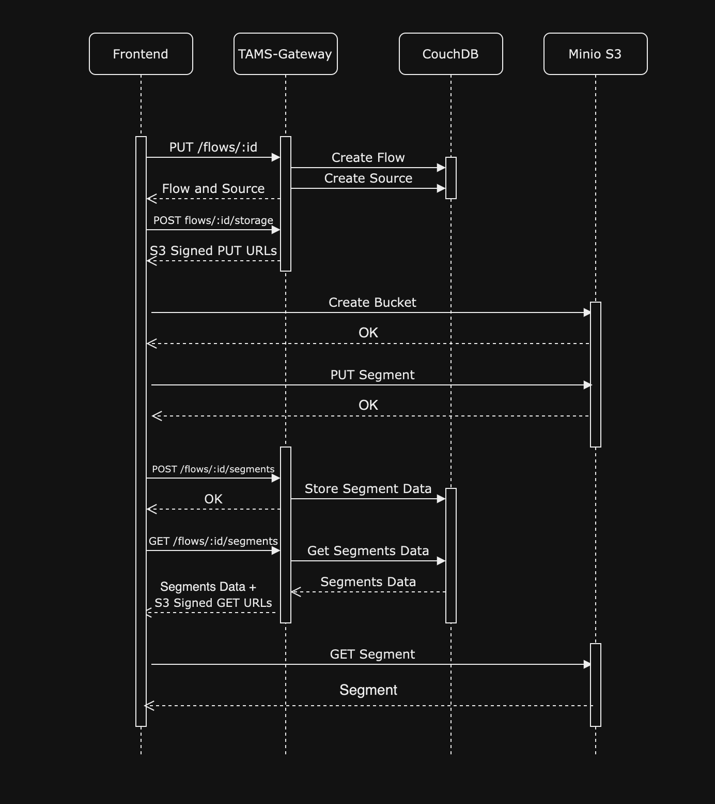

<h1 align="center">
  TAMS Gateway
</h1>

<div align="center">
  The Time-addressable Media Store (TAMS) stores segmented media flows by combining a media store that holds the individual media flow segments with a service that provides a database index for these segments.
</div>

<p align="center">
  
</p>

## Requirements

Node.js >= 18.15.0 ( LTS )  
A couchDB database (https://app.osaas.io/dashboard/service/apache-couchdb)  
An S3 Storage (https://app.osaas.io/dashboard/service/minio-minio)

## Installation / Usage

Install dependencies

```
yarn
```

Create an .env file based on the .env.sample file in the root of the project. Add to it:

```
DB_URL=<DB_URL>
DB_USERNAME=<DB_URL>
DB_PASSWORD=<DB_PASSWORD>
S3_ENDPOINT_URL=<S3_ENDPOINT_URL>
AWS_ACCESS_KEY_ID=<ACCESS_KEY_ID>
AWS_SECRET_ACCESS_KEY=<SECRET_ACCESS_KEY>
```

If you are using the couchDB and Minio services from OSC then this file will look like:

```
DB_URL=<LINK TO OSC COUCHDB SERVICE>
DB_USERNAME=admin
DB_PASSWORD=<AdminPassword>
S3_ENDPOINT_URL=<LINK TO OSC MINIO SERVICES>
AWS_ACCESS_KEY_ID=<RootUSer> //Set when creating OSC Minio Service
AWS_SECRET_ACCESS_KEY=<RootPassword> //Set when creating OSC Minio Service
```

To start TAMS-Gateway

```
yarn start
```

The API is then running on https://localhost:8000

## Development

To start TAMS-Gateway in development mode

```
yarn dev
```

The API is then running on https://localhost:8000

## Additional Resources

[BBC TAMS REPO](https://github.com/bbc/tams/blob/main/api/TimeAddressableMediaStore.yaml)  
[BBC TAMS API DOCS](https://bbc.github.io/tams/main/index.html#/)

## Contributing

See [CONTRIBUTING](CONTRIBUTING.md)

## License

This project is licensed under the MIT License, see [LICENSE](LICENSE).

# Support

Join our [community on Slack](http://slack.streamingtech.se) where you can post any questions regarding any of our open source projects. Eyevinn's consulting business can also offer you:

- Further development of this component
- Customization and integration of this component into your platform
- Support and maintenance agreement

Contact [sales@eyevinn.se](mailto:sales@eyevinn.se) if you are interested.

# About Eyevinn Technology

[Eyevinn Technology](https://www.eyevinntechnology.se) help companies in the TV, media, and entertainment sectors optimize costs and boost profitability through enhanced media solutions.
We are independent in a way that we are not commercially tied to any platform or technology vendor. As our way to innovate and push the industry forward, we develop proof-of-concepts and tools. We share things we have learn and code as open-source.

With Eyevinn Open Source Cloud we enable to build solutions and applications based on Open Web Services and avoid being locked in with a single web service vendor. Our open-source solutions offer full flexibility with a revenue share model that supports the creators.

Read our blogs and articles here:

- [Developer blogs](https://dev.to/video)
- [Medium](https://eyevinntechnology.medium.com)
- [OSC](https://www.osaas.io)
- [LinkedIn](https://www.linkedin.com/company/eyevinn/)

Want to know more about Eyevinn, contact us at info@eyevinn.se!
